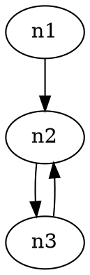

# A simple LTL model checker for teachers and students

We present a simple LTL model-checker built on top of the great tool [Spot](https://spot.lrde.epita.fr/). Our model-checker is inefficient and comes with strong limitations regarding its features. Still, it allows to model-check LTL formulas against finite transition systems. Moreover, it can output intermediate products of the model-checking process: the transition system, the Büchi automaton encoding the negation of the LTL formula, the product of the transition system and the automaton, and counter-examples when the formula does not hold on the transition system. This is actually good for teaching LTL model-checking.

## Requirements

The script `model-checker.py` is written in Python 3 and requires the following softwares:
- [Spot](https://spot.lrde.epita.fr/) including its python bindings (please refer to [installation instructions](https://spot.lrde.epita.fr/install.html))
- [Graphviz](https://graphviz.org/) the graph visualization software (please refer to [installation instructions](https://graphviz.org/download/))
- [pygraphviz](https://pygraphviz.github.io/) the Python binding for the graphviz library (installation with `pip`: [installation instructions](https://pypi.org/project/pygraphviz/))

## Usage

The script should be run as follows:

```
./model-checker.py [--output prefix] model.dot formula
```

where:
- `model.dot` is a transition system specified using the [graphviz/dot file format](https://www.graphviz.org/doc/info/lang.html) (see below for details).
- `formula` is an LTL formula specified using [Spot syntax for LTL formulas](https://spot.lrde.epita.fr/tl.pdf). The atomic propositions of the formula are the labels of the nodes in the transition system.
- `--output prefix` is optional. If specified, the script will output three files: `prefix-kipke.dot` that contains the transition system (Kripke structure) as seen by Spot, `prefix-automaton.dot` that contains the automaton for the negation of `formula`, and `prefix-product.dot` that contains the product of the automaton and the transition system. The `dot` tool can be used to covert these three files to human-readable files.

## Input format

Transition systems are specified as graphviz/dot graphs with specific attributes on nodes:



The example above defines transition system `foo` with three nodes and three edges. The nodes `n1` and `n3` are declared explicitely. The node `n2` is desclared implicitely.
- the attribute `initial` is optional and can take any non-empty string value. There should be exactly one initial node in the transition system. In the example above, `n1` is the initial node of the transition system.
- the attribute `labels` is optional and can take as value a non-empty comma-separated list of strings that specifies the set of atomic propositions that label the node. In the example above, `n` is labeled `a` and `b`, `n2` is not labeled, and `n3` is labeled `a`.

The example above introduces two atomic propositions: `a` and `b`, that can appear as atomic formulas in LTL requirements to check on this transition system: `[]a`, `[](a -> <>b)`,...
